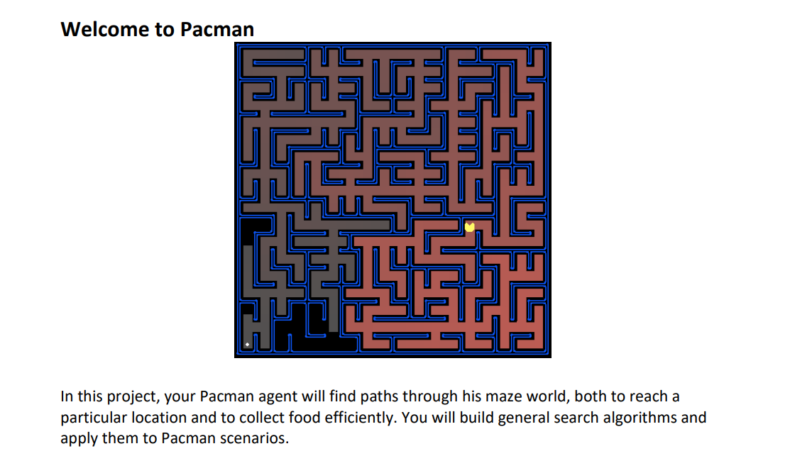

# CPSC-481_Project1

## CPSC-481 Project – Pacman StateSpaceSearch

### Group Members: Joshua Land, Sokheng Teang, and Mohammad Affan Khalil

Goal: Design a Depth-First Search (DFS) and Breadth-First Search (BFS) to complete a Pac-man game of various sizes

Goal: Implement CornersProblem and aStarSearch

Programing Language(s): Python

